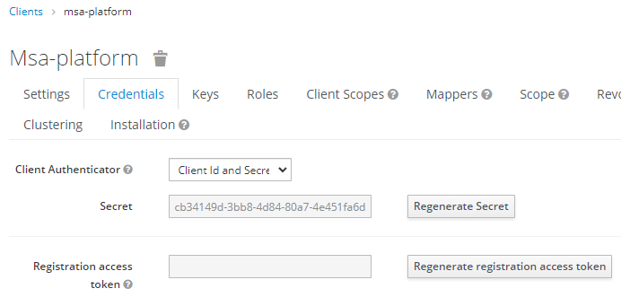
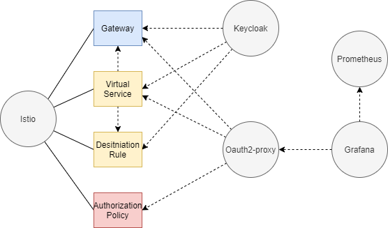

# MSA-Platform

----

- [MSA-Platform](#msa-platform)
  - [K3s 구성하기](#k3s-구성하기)
    - [설치하기](#설치하기)
    - [삭제하기](#삭제하기)
      - [도커 초기화하기](#도커-초기화하기)
  - [AS-IS](#as-is)
    - [~~Install Istio with Helm~~](#install-istio-with-helm)
    - [Install Istio with Operator](#install-istio-with-operator)
      - [Install istioctl](#install-istioctl)
      - [Deploy the Istio operator](#deploy-the-istio-operator)
      - [Install Istio with the operator](#install-istio-with-the-operator)
      - [Istio Gateway 생성하기](#istio-gateway-생성하기)
    - [Install Keycloak with Helm](#install-keycloak-with-helm)
      - [Istio Gateway 를 이용한 Keycloak 노출](#istio-gateway-를-이용한-keycloak-노출)
      - [Keycloak Client 생성하기](#keycloak-client-생성하기)
    - [Install oauth2-proxy](#install-oauth2-proxy)
      - [Istio Configuration](#istio-configuration)
        - [By using istio operator](#by-using-istio-operator)
        - [~~By using istioctl~~](#by-using-istioctl)
      - [oauth2-proxy VirtualService 만들기](#oauth2-proxy-virtualservice-만들기)
    - [Install Prometheus](#install-prometheus)
    - [Install Grafana](#install-grafana)
      - [Istio Gateway 를 이용한 Grafana 노출](#istio-gateway-를-이용한-grafana-노출)
      - [Grafana 관련 oauth2-proxy 설정](#grafana-관련-oauth2-proxy-설정)
  - [TO-BE](#to-be)
    - [CRDs](#crds)
    - [Use existing Keycloak Operator](#use-existing-keycloak-operator)
    - [Create an Keycloak Operator from the scratch](#create-an-keycloak-operator-from-the-scratch)

----

## K3s 구성하기

### 설치하기

시스템 데몬 설치하기

```sh
git clone https://github.com/DamionGans/ubuntu-wsl2-systemd-script.git
cd ubuntu-wsl2-systemd-script/
bash ubuntu-wsl2-systemd-script.sh
```

Then exit the Ubuntu shell and try running systemctl

```sh
systemctl
```

도커 설치하기

```sh
curl https://get.docker.com | sh
```

k3s 설치하기

```sh
curl -sfL https://get.k3s.io | sh -s - --no-deploy traefik --docker --write-kubeconfig-mode 644
```

### 삭제하기

```sh
/usr/local/bin/k3s-uninstall.sh
```

#### 도커 초기화하기

> k3s 삭제한 후 기존 도커에서 실행 중인 프로세스 종료시키고 도커 이미지 삭제  
>
> - https://typeofnan.dev/how-to-stop-all-docker-containers/

실행중인 모든 프로세스 종료

```sh
docker kill $(docker ps -q)
```

모든 이미지 삭제

```sh
docker rmi -f $(docker images -q)
```

## AS-IS

> 여기서 사용한 Helm 차트는 eMarket 에 사용된 것이다.

Helm 을 이용한 구성

- istio-gateway
- odic-proxy
- keycloak
- prometheus / grafana

1. K8s에 Helm 으로 구성
2. 필요한 정보 구성
3. 전체 연동
4. 이를 바탕으로 platform 화에 대한 설계 및 개발

시나리오 수동 구성과 platform 의 자동 구성 차이를 설명하자.

- 설치하는 시나리오
- 삭제하는 시나리오

### ~~Install Istio with Helm~~

:hand: Istio 에서 Operator 를 제공하므로 Operator로 해보자. [Istio Operator Install](#istio-operator-install)

> - 1.11.4 버전 활용
> - https://istio.io/latest/docs/setup/install/helm/

```sh
curl -L https://istio.io/downloadIstio | ISTIO_VERSION=1.11.4 TARGET_ARCH=x86_64 sh -
```

### Install Istio with Operator

> - https://istio.io/latest/docs/setup/install/operator/

#### Install istioctl

> - https://istio.io/latest/docs/ops/diagnostic-tools/istioctl/

```sh
curl -sL https://istio.io/downloadIstioctl | sh -
```

Add the istioctl client to your path, on a macOS or Linux system:

```sh
export PATH=$PATH:$HOME/.istioctl/bin
```

#### Deploy the Istio operator

```sh
istioctl operator init
```

#### Install Istio with the operator

```sh
kubectl apply -f - <<EOF
apiVersion: install.istio.io/v1alpha1
kind: IstioOperator
metadata:
  namespace: istio-system
  name: istiocontrolplane
spec:
  profile: default
EOF
```

> profile 을 데모로 하면 `istiod` 와 `istio-ingressgateway` 를 설치한다. 자세한 정보는 여기 [config profiles](https://istio.io/latest/docs/setup/additional-setup/config-profiles/)

|                        | default | demo | minimal | external | empty | preview |
|------------------------|---------|------|---------|----------|-------|---------|
| Core components        |         |      |         |          |       |         |
| - istio-egressgateway  |         | ✔   |         |          |       |
| - istio-ingressgateway | ✔      | ✔    |         |          |       | ✔      |
| - istiod               | ✔      | ✔    | ✔      |          |       | ✔       |

관련된 pod 조회

```console
$ kubectl get po -A
NAMESPACE        NAME                                      READY   STATUS    RESTARTS   AGE
istio-operator   istio-operator-6f9dcd4469-w4n45           1/1     Running   0          4h45m
istio-system     istiod-59b7bcdb74-c4gtn                   1/1     Running   0          4h34m
istio-system     svclb-istio-ingressgateway-kxlnr          3/3     Running   0          4h34m
istio-system     istio-ingressgateway-8dbb57f65-2qx6z      1/1     Running   0          4h34m
```

#### Istio Gateway 생성하기

> 여기서 생성한 Gateway `ingress-gateway` 를 다른 곳에서 사용할 것이다. 

```sh
vi ingress-gateway.yaml
```

```yaml
apiVersion: networking.istio.io/v1alpha3
kind: Gateway
metadata:
  name: ingress-gateway
spec:
  selector:
    istio: ingressgateway # use istio default controller
  servers:
  - port:
      number: 80
      name: http
      protocol: HTTP
    hosts:
    - "*"
    tls:
      httpsRedirect: false
```

### Install Keycloak with Helm

> - https://github.com/codecentric/helm-charts/tree/master/charts/keycloak (GDC에서 사용)
> - ~~https://bitnami.com/stack/keycloak/helm~~

```sh
helm repo add codecentric https://codecentric.github.io/helm-charts
```

```sh
vi keycloak-values.yaml
```

```yaml
contextPath: auth

extraEnv: |
  - name: KEYCLOAK_USER
    value: admin
  - name: KEYCLOAK_PASSWORD
    value: admin
```

> - contextPath : `/auth` 로 서비스. istio ingress-gateway 에서 '/auth'로 포워딩하기 위함.
> - [Creating a Keycloak Admin User](https://github.com/codecentric/helm-charts/issues/169)

```sh
helm install keycloak codecentric/keycloak --values keycloak-values.yaml
```

keycloak 가 모두 실행 된 후에 아래 명령으로 port-forwarding 을 통해서 접근할 수 있다.

```sh
export POD_NAME=$(kubectl get pods --namespace default -l "app.kubernetes.io/name=keycloak,app.kubernetes.io/instance=keycloak" -o name)
echo "Visit http://127.0.0.1:8080 to use your application"
kubectl --namespace default port-forward "$POD_NAME" 8080
```

> - 음..근데 id / password 가 뭐지?
> - 접속해 보면 홈에서 계정 생성을 바로 할 수 있다. 여기서 생성하면 로그인이 가능하다.

#### Istio Gateway 를 이용한 Keycloak 노출

```sh
vi keycloak-vs.yaml
```

```yaml
apiVersion: networking.istio.io/v1alpha3
kind: VirtualService
metadata:
  name: keycloak
spec:
  hosts:
  - "*"
  # - localhost
  gateways:
  - ingress-gateway
  http:
  - match:
    - uri:
        exact: /auth
    - uri:
        prefix: /auth
    route:
    - destination:
        host: keycloak-http.default.svc.cluster.local
        port:
          number: 80
```

#### Keycloak Client 생성하기

> 일단은 수동으로 생성해 본다.

Add Client

- Client ID : msa-platform
- Client Protocol : openid-connect

Fill in details as below:

- `Base URL` : /realms/master/account
- `Root URL` : http://172.19.50.111/auth
  - URL의 ip 는 istio gateway 의 ip 이다.
- `Valid Redirect URIs` : *
  - `/realms/master/account/*` 로 입력하면 `Invalid parameter: redirect_uri` 에러 발생
  - `Invalid parameter: redirect_uri` 에러는 Keycloak 의 Client 설정에서 `Valid Redirect URIs`에 `*`를 주면 동작은 하는데, 이건 Production 에서는 사용하면 안된다고 한다. [\[참고\]](https://stackoverflow.com/questions/45352880/keycloak-invalid-parameter-redirect-uri)
  - ~~전체 URL  `Root URL` + `Valid Redirect URIs`로 `http://172.19.50.111/auth/realms/msa-patform/account/*` 의 형태로 동작한다.~~
- `Access Type` : confidential

After saving it, let's check the `Client Id and Secret` in the `Credentials` tab.



I'll use `msa-platform` as a Client ID and `cb34149d-3bb8-4d84-80a7-4e451fa6d708` as a Secret.

### Install oauth2-proxy

> - https://github.com/oauth2-proxy/manifests/tree/main/helm/oauth2-proxy
> - https://github.com/oauth2-proxy/oauth2-proxy

```sh
helm repo add oauth2-proxy https://oauth2-proxy.github.io/manifests
```

```sh
vi oauth2-proxy-values.yaml
```

```yaml
config:
  clientID: msa-platform
  clientSecret: 89714ada-3894-4581-aea6-3d1e80174b24

service: 
  portNumber: 4180

extraArgs: 
  provider: oidc
  provider-display-name: "Keycloak"
  oidc-issuer-url: http://172.19.50.111/auth/realms/master
  login-url: http://172.19.50.111/auth/realms/master/protocol/openid-connect/auth
  redeem-url: http://172.19.50.111/auth/realms/master/protocol/openid-connect/token
  validate-url: http://172.19.50.111/auth/realms/master/protocol/openid-connect/userinfo
  redirect-url: http://172.19.50.111/oauth2/callback
  scope: "openid profile email"
  insecure-oidc-allow-unverified-email: true
  email-domain: "*"
  cookie-secure: false
  cookie-secret: "UHJhU0lGQXNLN2J0dzFOWUlYYXFITTRKRC8rUHRvME4="
  # scope: "openid email"
  # upstream: static://200
  # insecure-oidc-allow-unverified-email: true
  # email-domain: "*"
  cookie-secure: false
  pass-user-headers: true
  pass-authorization-header: true # pass OIDC IDToken to upstream via Authorization Bearer header
  set-authorization-header: true # Authorization: Bearer <JWT>
  pass-basic-auth: false
  pass-access-token: true
  # provider-display-name: Keycloak
  # cookie-expire: 5m  
  standard-logging: true
  auth-logging: true
  request-logging: true
  skip-provider-button: true
  session-store-type: cookie
  # redirect-url: "http://172.19.50.111/oauth2/callback"
  # # cookie-domain: "<COOKIE_DOMAIN>"
  # # cookie-samesite: lax
  # # cookie-refresh: 1h
  # # cookie-expire: 4h
  set-xauthrequest: true
  reverse-proxy: true
  pass-access-token: true # X-Auth-Request-Access-Token, must first enable --set-xauthrequest
  pass-host-header: true # pass the request Host Header to upstream  
  # scope: "openid email"  
  # skip-provider-button: true
  whitelist-domain: 172.19.50.111
  # # oidc-jwks-url: <JWKS_URL> # this is accessed by proxy in-mesh - http  
  # skip-oidc-discovery: true
  # # redirect-url: <REDIRECT_URL>    

authenticatedEmailsFile
```

- `openssl rand -base64 32 | head -c 32 | base64` 명령으로 Cookie Secret 값 생성

```sh
helm install oauth2-proxy oauth2-proxy/oauth2-proxy --values oauth2-proxy-values.yaml
```

아래는 설치 시 로그

```console
NAME: oauth2-proxy
LAST DEPLOYED: Thu Oct 21 00:05:48 2021
NAMESPACE: default
STATUS: deployed
REVISION: 1
TEST SUITE: None
NOTES:
To verify that oauth2-proxy has started, run:

  kubectl --namespace=default get pods -l "app=oauth2-proxy"
```

- http://172.19.50.111/auth/realms/master/.well-known/openid-configuration 의 주소를 접속하면 여러 정보가 나온다.
- `Invalid parameter: redirect_uri` 에러는 Keycloak 의 Client 설정에서 `Valid Redirect URIs`에 `*`를 주면 동작은 하는데, 이건 Production 에서는 사용하면 안된다고 한다. [\[참고\]](https://stackoverflow.com/questions/45352880/keycloak-invalid-parameter-redirect-uri)

#### Istio Configuration

> - https://medium.com/@lucario/istio-external-oidc-authentication-with-oauth2-proxy-5de7cd00ef04

##### By using istio operator

> - https://istio.io/latest/docs/reference/config/istio.operator.v1alpha1/
> - https://kubernetes.io/docs/tasks/manage-kubernetes-objects/update-api-object-kubectl-patch/
> - https://github.com/kubernetes/kubernetes/issues/71024

```sh
vi updated-profile.yaml
```

```yaml
spec:
  meshConfig:
    extensionProviders:
      - name: "oauth2-proxy"
        envoyExtAuthzHttp:
          service: "oauth2-proxy.default.svc.cluster.local"
          port: "4180" # The default port used by oauth2-proxy.
          includeHeadersInCheck: ["authorization", "cookie"] # headers sent to the oauth2-proxy in the check request.
          headersToUpstreamOnAllow: ["authorization", "path", "x-auth-request-user", "x-auth-request-email", "x-auth-request-access-token"] # headers sent to backend application when request is allowed.
          headersToDownstreamOnDeny: ["content-type", "set-cookie"] # headers sent back to the client when request is denied.
```

```sh
kubectl patch istiooperator istiocontrolplane -n istio-system --patch "$(cat updated-profile.yaml)" --type=merge
```

아래 명령으로 확인해 보면 위 설정이 들어간 것을 알 수 있다.

```sh
kubectl get istiooperator istiocontrolplane -n istio-system -o yaml
```

##### ~~By using istioctl~~

> istioctl 을 이용해서 설치하는 건데 istio operator 를 사용하는 경우 동작하지 않음

```sh
vi updated-profile.yaml
```

```yaml
meshConfig:
  extensionProviders:
    - name: "oauth2-proxy"
      envoyExtAuthzHttp:
        service: "oauth2-proxy.default.svc.cluster.local"
        port: "4180" # The default port used by oauth2-proxy.
        includeHeadersInCheck: ["authorization", "cookie"] # headers sent to the oauth2-proxy in the check request.
        headersToUpstreamOnAllow: ["authorization", "path", "x-auth-request-user", "x-auth-request-email", "x-auth-request-access-token"] # headers sent to backend application when request is allowed.
        headersToDownstreamOnDeny: ["content-type", "set-cookie"] # headers sent back to the client when request is denied.
```

```sh
istioctl install -f updated-profile.yaml
```

#### oauth2-proxy VirtualService 만들기

> :point_right: 이거 만들어 주지 않아서 동작안했는데 한참을 헤맴.
> `kubectl logs $(kubectl -n istio-system get pods -l app=istiod -o jsonpath='{.items[0].metadata.name}') -c discovery -n istio-system` 명령으로 로그를 확인해 보니 다음과 같은 메시지를 보고 VirtualService 가 필요한지 확인함.
>
> ```diff
>   2021-10-24T09:59:26.471240Z     info    ads     EDS: PUSH request for > node:istio-ingressgateway-8dbb57f65-2qx6z.istio-system resources:24 size:3.9kB empty:0 > cached:24/24
> - 2021-10-24T09:59:54.885186Z     info    ads     Incremental push, service oauth2-proxy.> default.svc.cluster.local has no endpoints
>   2021-10-24T09:59:54.994091Z     info    ads     Push debounce stable[162] 6: 100.5201ms > since last change, 130.1483ms since last push, full=true
> ```
>
> :point_right: Grafana 의 경우 Grafana의 VirtualService 를 만들었더니 바로 접근이 가능했고 이를 지우니 oauth2-proxy 로 접근함.

```sh
vi oauth2-proxy-vs.yaml
```

```yaml
apiVersion: networking.istio.io/v1alpha3
kind: VirtualService
metadata:
  name: oauth2-proxy
spec:
  gateways:
  - ingress-gateway
  hosts:
  - '*'
  http:
  - route:
    - destination:
        host: oauth2-proxy.default.svc.cluster.local
        port:
          number: 4180
```

### Install Prometheus

> - https://github.com/prometheus-community/helm-charts/tree/main/charts/prometheus

```sh
helm repo add prometheus-community https://prometheus-community.github.io/helm-charts
helm repo add kube-state-metrics https://kubernetes.github.io/kube-state-metrics
helm repo update
```

```sh
helm install prometheus prometheus-community/prometheus --set nodeExporter.hostRootfs=false
```

> - `hostRootfs` 값 지정하지 않고 WSL2 에서 실행시 에러 발생
> - `Error: failed to start container "prometheus-node-exporter": Error response from daemon: path / is mounted on / but it is not a shared or slave mount` 에러 발생
> - [링크](https://github.com/prometheus-community/helm-charts/issues/467) 글 참고해서 values 에서 다음 값을 지정하고 해보니 실행됨
>
> ```yaml
> nodeExporter:
>   hostRootfs: false
> ```

아래는 설치 시 로그

```sh
WARNING: Kubernetes configuration file is group-readable. This is insecure. Location: /etc/rancher/k3s/k3s.yaml
WARNING: Kubernetes configuration file is world-readable. This is insecure. Location: /etc/rancher/k3s/k3s.yaml
NAME: prometheus
LAST DEPLOYED: Wed Oct 20 05:01:04 2021
NAMESPACE: default
STATUS: deployed
REVISION: 1
TEST SUITE: None
NOTES:
The Prometheus server can be accessed via port 80 on the following DNS name from within your cluster:
prometheus-server.default.svc.cluster.local


Get the Prometheus server URL by running these commands in the same shell:
  export POD_NAME=$(kubectl get pods --namespace default -l "app=prometheus,component=server" -o jsonpath="{.items[0].metadata.name}")
  kubectl --namespace default port-forward $POD_NAME 9090


The Prometheus alertmanager can be accessed via port 80 on the following DNS name from within your cluster:
prometheus-alertmanager.default.svc.cluster.local


Get the Alertmanager URL by running these commands in the same shell:
  export POD_NAME=$(kubectl get pods --namespace default -l "app=prometheus,component=alertmanager" -o jsonpath="{.items[0].metadata.name}")
  kubectl --namespace default port-forward $POD_NAME 9093
#################################################################################
######   WARNING: Pod Security Policy has been moved to a global property.  #####
######            use .Values.podSecurityPolicy.enabled with pod-based      #####
######            annotations                                               #####
######            (e.g. .Values.nodeExporter.podSecurityPolicy.annotations) #####
#################################################################################


The Prometheus PushGateway can be accessed via port 9091 on the following DNS name from within your cluster:
prometheus-pushgateway.default.svc.cluster.local


Get the PushGateway URL by running these commands in the same shell:
  export POD_NAME=$(kubectl get pods --namespace default -l "app=prometheus,component=pushgateway" -o jsonpath="{.items[0].metadata.name}")
  kubectl --namespace default port-forward $POD_NAME 9091

For more information on running Prometheus, visit:
https://prometheus.io/
```

### Install Grafana

> - https://github.com/grafana/helm-charts/tree/main/charts/grafana

```sh
helm repo add grafana https://grafana.github.io/helm-charts
helm repo update
```

Prometheus datasource 지정을 위해 `grafana-values.yaml`을 만들자.

```sh
vi grafana-values.yaml
```

```yaml
datasources:
  datasources.yaml:
    apiVersion: 1
    datasources:
    - name: Prometheus
      type: prometheus
      url: http://prometheus-server.default.svc.cluster.local
      access: proxy
      isDefault: true
grafana.ini:
  server:
    domain: monitoring.example.com
    root_url: "%(protocol)s://%(domain)s/grafana"
    serve_from_sub_path: true
  auth.anonymous:
    enabled: true
    org_role: Admin # Viewer, Editor, Admin
```

> - :point_right: `server` 섹션의 `root_url` 과 `serve_from_sub_path` 설정을 해야만 istio gateway 에서 `/grafana`로 라우팅 할때 `/grafana/*` 로 서비스가 되어 정상동작한다. 이걸 설정하지 않으면 `/grafana` 로 접속해도 `/login` 으로 변경되어 404 가 발생하거나 /login 을 다시 grafana 의 /login 으로 redirection 하도록 설정해야 한다. <u>이거 때문에 한참을 헤매었는데 이건 istio gateway 에서 해결하는 부분이 아님을 알았다.</u>
> - [Grafana Anonymous Authentication](https://grafana.com/docs/grafana/latest/auth/grafana/#anonymous-authentication)

위 파일을 values 에 지정하여 설치

```sh
helm install grafana grafana/grafana --values grafana-values.yaml
```

아래는 로그

```console
NAME: grafana
LAST DEPLOYED: Wed Oct 20 05:31:25 2021
NAMESPACE: default
STATUS: deployed
REVISION: 1
NOTES:
1. Get your 'admin' user password by running:

   kubectl get secret --namespace default grafana -o jsonpath="{.data.admin-password}" | base64 --decode ; echo

2. The Grafana server can be accessed via port 80 on the following DNS name from within your cluster:

   grafana.default.svc.cluster.local

   Get the Grafana URL to visit by running these commands in the same shell:

     export POD_NAME=$(kubectl get pods --namespace default -l "app.kubernetes.io/name=grafana,app.kubernetes.io/instance=grafana" -o jsonpath="{.items[0].metadata.name}")
     kubectl --namespace default port-forward $POD_NAME 3000

3. Login with the password from step 1 and the username: admin
#################################################################################
######   WARNING: Persistence is disabled!!! You will lose your data when   #####
######            the Grafana pod is terminated.                            #####
#################################################################################
```

아래 명령으로 port-forward 설정하고 Import 메뉴에서 `11074` 입력하면 그래프 나옴.

```sh
export POD_NAME=$(kubectl get pods --namespace default -l "app.kubernetes.io/name=grafana,app.kubernetes.io/instance=grafana" -o jsonpath="{.items[0].metadata.name}")
     kubectl --namespace default port-forward $POD_NAME 3000
```

#### Istio Gateway 를 이용한 Grafana 노출

Istio Gateway 생성하기

```sh
vi ingress-gateway.yaml
```

```yaml
apiVersion: networking.istio.io/v1alpha3
kind: Gateway
metadata:
  name: ingress-gateway
spec:
  selector:
    istio: ingressgateway # use istio default controller
  servers:
  - port:
      number: 80
      name: http
      protocol: HTTP
    hosts:
    - "*"
    tls:
      httpsRedirect: false
```

Istio VirtualService 생성하기

```sh
vi grafana-vs.yaml
```

```yaml
apiVersion: networking.istio.io/v1alpha3
kind: VirtualService
metadata:
  name: grafana
spec:
  hosts:
  - "*"
  gateways:
  - ingress-gateway
  http:
  - match:
    - uri:
        exact: /grafana
    - uri:
        prefix: /grafana
    # rewrite:
    #   uri: /
    route:
    - destination:
        host: grafana.default.svc.cluster.local
        port:
          number: 80
```

Istio DestinationRule 생성하기

```sh
vi grafana-dr.yaml
```

```yaml
apiVersion: networking.istio.io/v1alpha3
kind: DestinationRule
metadata:
  name: grafana
spec:
  host: grafana.default.svc.cluster.local
  trafficPolicy:
    tls:
      mode: DISABLE
```

이렇게 하고 `/grafana` 로 접속하면 된다.

#### Grafana 관련 oauth2-proxy 설정

AuthorizationPolicy 를 만들자.

```sh
vi grafana-ap.yaml
```

```yaml
apiVersion: security.istio.io/v1beta1
kind: AuthorizationPolicy
metadata:
  name: grafana-auth-policy
spec:
  action: CUSTOM
  provider:
    name: "oauth2-proxy"
  rules:
  - to:
    - operation:
        paths: ["/grafana"]  
```

## TO-BE

- [Istio 는 기존 Operator 를 활용](https://istio.io/latest/docs/setup/install/operator/)
- [Oidc Operator 개발 (Go 기반)](to-be/oidc-operator)
- [Keycloak Operator 개발 (Helm Chart 기반)](to-be/keycloak-operator)
- Oidc 에서 Keycloak 를 사용하는 형태로 개발



### CRDs

```yaml
apiVersion: "arch.sds.com/v1"
kind: Oidc
metadata:
  name: my-oidc
spec:
  type: default # default 는 생략가능하고, Keycloak 이다.
  contextPath: /auth
  ingress:
    type: default # default 는 생략가능하고, Istio 이다.
    enabled: true # default 는 false
```

```sh
Kubectl get oidc
```

```yaml
apiVersion: "arch.sds.com/v1"
kind: ServiceMesh
metadata:
  name: my-service-mesh
```

```sh
kubectl get servicemesh
```

```sh
kubectl get gatgeway
```

```sh
kubectl get virtualservice
```

```sh
kubectl get sts
```

### Use existing Keycloak Operator

> - https://github.com/keycloak/keycloak-operator

```sh
git clone https://github.com/keycloak/keycloak-operator.git
```

```sh
cd keycloak-operator/
```

```sh
make cluster/prepare
```

### Create an Keycloak Operator from the scratch

> - https://sdk.operatorframework.io/docs/building-operators/helm/quickstart/

```sh
mkdir keycloak-operator 
cd keycloak-operator 
```

```sh
operator-sdk init --domain sds.com --plugins helm
```

```sh
operator-sdk create api --group arch --version v1 --kind Keycloak --helm-chart=keycloak --helm-chart-repo=https://codecentric.github.io/helm-charts
```

```sh
make docker-build
```

```sh
make deploy
```

```sh
kubectl edit deploy keycloak-operator-controller-manager -n keycloak-operator-system
```

```yaml
        image: controller:latest
        imagePullPolicy: Never
```

```sh
kubectl apply -f config/samples/arch_v1_keycloak.yaml
```

pod 생성 완료
